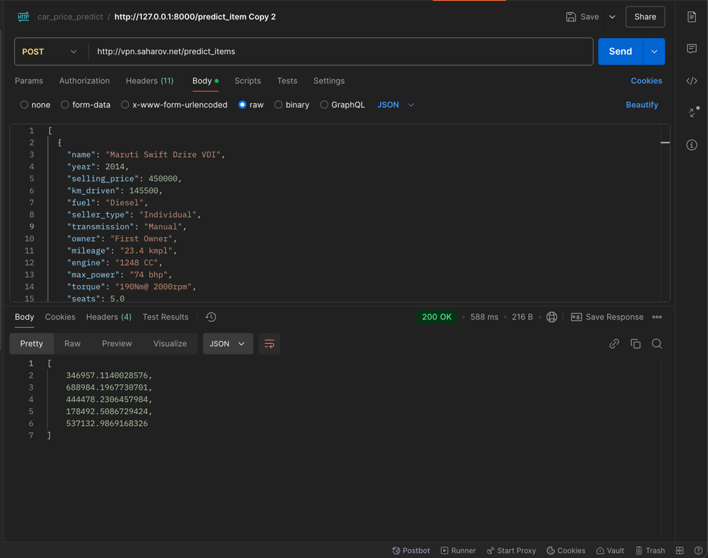

# Учебный сервис предсказания цены на автомобиль
### Студент: Михаил Сахаров ИИ-24 (Base)

Согласно заданию создан сервис для инференса модели. В качестве фрэймворка используется fastapi.
Сервис упакован в докер контейнер. Я хотел развернуть его на своей виртуалке, но ставить там все зависимости нет желания. 

### Публичный репозиторий проекта

https://github.com/mcccccccccc/car_predict

### Подготовка модели в colab
В колаб ML часть и сохрание pkl файла:

https://colab.research.google.com/drive/1fHx8fmsmR80W4bODKhMpR1vXllC9NDme?usp=sharing

Модель получилась ужасная! Все делал строго по заданиям, но точно выше R^2=0.6 не была. Предсказания получаются отрицательные. Если найду время поковыряю еще. Мое подозрение что там все плохо с выбросами, и надо параметры регуляризации подбирать видимо.   

### Pickle файл
`app/model_linreg_cars.pkl` - файл с пайплайном. Внутри в т ч модель с весами.

С ним вознкла проблема которая заняла пол ночи. В пайплайне у меня есть кастомный трансформер. 
Файл plk сохранился норм, в колабе в отдельном документе он открылся, но надо было перенести класс этого трансформара - все верно. 
Но в проекте fastapi он никак не загружался. Вылетала ошибка что нет этого класса. Пробовал вставить его во все места и в т ч рядом с кодом импорта pkl - ничего не помогло.
В итоге сделал пайплан без него. А эту обработку перенес в коде. Речь про `app.pipline.convert_str_cols` метод.

### Запуск локально без докера

Чтобы запустить локально проект без докера надо установить зависимости и запустить fastapi в директории проекта: 
- `pip install -r /code/requirements.txt`
- `fastapi dev app/app.py`

### Сборка контейнера

Поместил проект в докер. Dockerfile имеется. 

Собрать контейнер: 

`docker build -t mc_ml_image .`

Запустить контейнер на 80 порту:

`docker run -it --rm -d --name mc_ml -p 80:80 mc_ml_image`

### Развернул сервис на своей виртуалке

Скрипшот тогок ак делаю запросы на него из Postman:



Вот рабочие запросы:

1. predict_items:

```
curl --location 'http://vpn.saharov.net/predict_items' \
--header 'accept: application/json' \
--header 'Content-Type: application/json' \
--data-raw '[
  {
    "name": "Maruti Swift Dzire VDI",
    "year": 2014,
    "selling_price": 450000,
    "km_driven": 145500,
    "fuel": "Diesel",
    "seller_type": "Individual",
    "transmission": "Manual",
    "owner": "First Owner",
    "mileage": "23.4 kmpl",
    "engine": "1248 CC",
    "max_power": "74 bhp",
    "torque": "190Nm@ 2000rpm",
    "seats": 5.0
  },
  {
    "name": "Skoda Rapid 1.5 TDI Ambition",
    "year": 2014,
    "selling_price": 370000,
    "km_driven": 120000,
    "fuel": "Diesel",
    "seller_type": "Individual",
    "transmission": "Manual",
    "owner": "Second Owner",
    "mileage": "21.14 kmpl",
    "engine": "1498 CC",
    "max_power": "103.52 bhp",
    "torque": "250Nm@ 1500-2500rpm",
    "seats": 5.0
  },
  {
    "name": "Hyundai i20 Sportz Diesel",
    "year": 2010,
    "selling_price": 225000,
    "km_driven": 127000,
    "fuel": "Diesel",
    "seller_type": "Individual",
    "transmission": "Manual",
    "owner": "First Owner",
    "mileage": "23.0 kmpl",
    "engine": "1396 CC",
    "max_power": "90 bhp",
    "torque": "22.4 kgm at 1750-2750rpm",
    "seats": 5.0
  },
  {
    "name": "Maruti Swift VXI BSIII",
    "year": 2007,
    "selling_price": 130000,
    "km_driven": 120000,
    "fuel": "Petrol",
    "seller_type": "Individual",
    "transmission": "Manual",
    "owner": "First Owner",
    "mileage": "16.1 kmpl",
    "engine": "1298 CC",
    "max_power": "88.2 bhp",
    "torque": "11.5@ 4,500(kgm@ rpm)",
    "seats": 5.0
  },
  {
    "name": "Hyundai Xcent 1.2 VTVT E Plus",
    "year": 2017,
    "selling_price": 440000,
    "km_driven": 45000,
    "fuel": "Petrol",
    "seller_type": "Individual",
    "transmission": "Manual",
    "owner": "First Owner",
    "mileage": "20.14 kmpl",
    "engine": "1197 CC",
    "max_power": "81.86 bhp",
    "torque": "113.75nm@ 4000rpm",
    "seats": 5.0
  }
]'
```

2. predict_item: 

```
curl --location 'http://vpn.saharov.net/predict_item' \
--header 'accept: application/json' \
--header 'Content-Type: application/json' \
--data-raw '  {
    "name": "Maruti Swift Dzire VDI",
    "year": 2014,
    "selling_price": 450000,
    "km_driven": 145500,
    "fuel": "Diesel",
    "seller_type": "Individual",
    "transmission": "Manual",
    "owner": "First Owner",
    "mileage": "23.4 kmpl",
    "engine": "1248 CC",
    "max_power": "74 bhp",
    "torque": "190Nm@ 2000rpm",
    "seats": 5.0
  }'
  ```